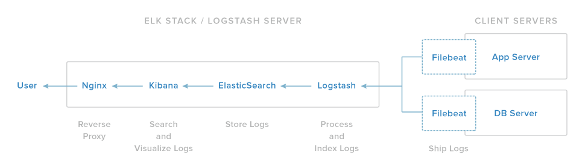

# Logging-ELK

Centralizing server logs to a main ELK server

## Overview

Here we'll try to explain how to centralize your logs using an ELK Stack in our main server.
We can accomplish that escenario with a physical server-host or a virtual machine.

If we have the time, we'll try splitting the services on individual Docker containers!
That way we could forget about requirements and run everything on Dockers, anywhere.

For now we'll try setting it all up directly in our physical/virtual server.

## Technologies

We'll need to use the following for our setup:

### ELK - Main Server Technologies

* [Logstash](https://www.elastic.co/products/logstash)
* [Elasticsearch](https://www.elastic.co/products/elasticsearch)
* [Kibana](https://www.elastic.co/products/kibana)

### Senders - Client Servers Technologies

* [Filebeat](https://www.elastic.co/products/beats/filebeat)

Logstash is an open source tool for collecting, parsing, and storing logs for future use.

Kibana is a web interface that can be used to search and view the logs that Logstash has indexed.

Both of these tools are based on Elasticsearch, which is used for storing logs.

## Final Infrastructure

